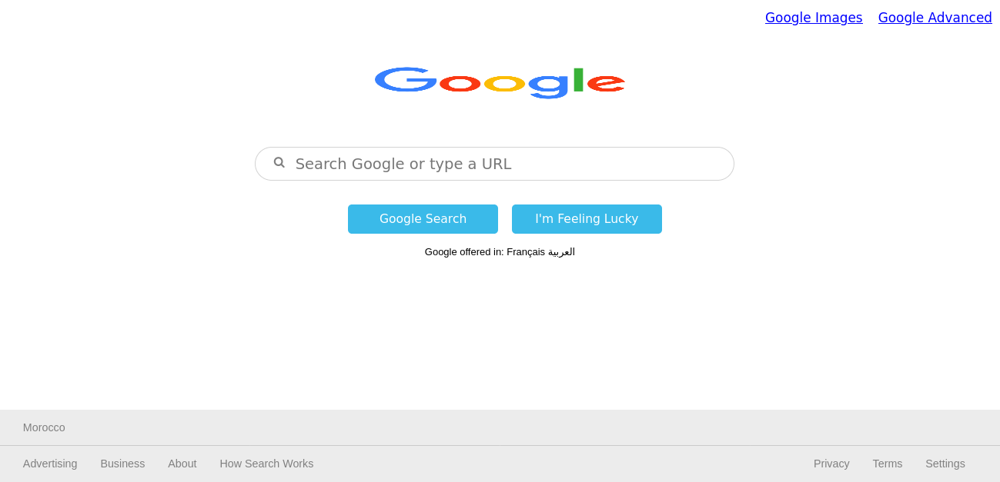
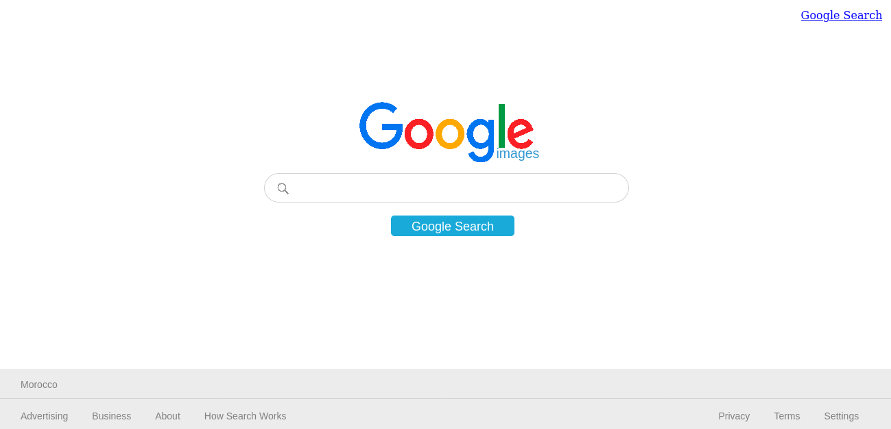
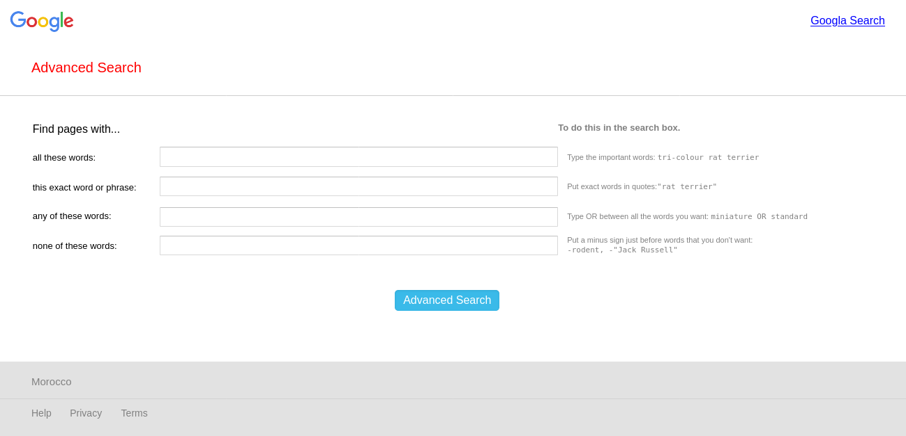

# CS50’s Web Programming with Python and JavaScript - Search solution

This is a solution to the [Search project_00 on CS50W](https://www.edx.org/course/cs50s-web-programming-with-python-and-javascript). CS50 course help you improve your programming skills, diving you more deeply into the design and implementation of web apps with Python, JavaScript, and SQL using frameworks like Django, React, and Bootstrap.

## Table of contents

- [CS50’s Web Programming with Python and JavaScript - Search solution](#cs50s-web-programming-with-python-and-javascript---search-solution)
  - [Table of contents](#table-of-contents)
  - [Overview](#overview)
    - [The project](#the-project)
    - [Screenshot](#screenshot)
  - [My process](#my-process)
    - [Built with](#built-with)
    - [What I learned](#what-i-learned)
    - [Continued development](#continued-development)
  - [Author](#author)
  - [Acknowledgments](#acknowledgments)

## Overview

Design a front-end for Google Search, Google Image Search, and Google Advanced Search.

### The project

- Pages. The website have at least three pages: one for Google Search, one for Google Image Search, and one for Google Advanced Search.

    On the Google Search page, there are links in the upper-right of the page to go to Image Search or Advanced Search. On each of the other two pages, there is a link in the upper-right to go back to Google Search.

- Query Text. On the Google Search page, the user is able to type in a query, click “Google Search”, and be taken to the Google search results for that page.

    Like Google’s own, the search bar is centered with rounded corners. The search button also is centered, and is beneath the search bar.

Query Images. On the Google Image Search page, the user is able to type in a query, click a search button, and be taken to the Google Image search results for that page.
Query Advanced. On the Google Advanced Search page, the user is able to provide input for the following four fields (taken from Google’s own advanced search options)

    Find pages with… “all these words:”
    Find pages with… “this exact word or phrase:”
    Find pages with… “any of these words:”
    Find pages with… “none of these words:”

### Screenshot

## My process

### Built with

- Semantic HTML5 markup
- CSS custom properties
- Flexbox
- Query String 

### What I learned

How to use Query string to improve your search

### Continued development

CS50 is very usefull course need i background in some programming language so i will take time stuying python and Qjango before complite the course.

## Author

- Facebook - [Tariq El bouhali](https://www.facebook.com/tariqelbouhali)

## Acknowledgments

I so grateful to Harvard for all lectures, projects and the wide community  providing for us, it's really environment where we can improve our knowledge in web programming.
